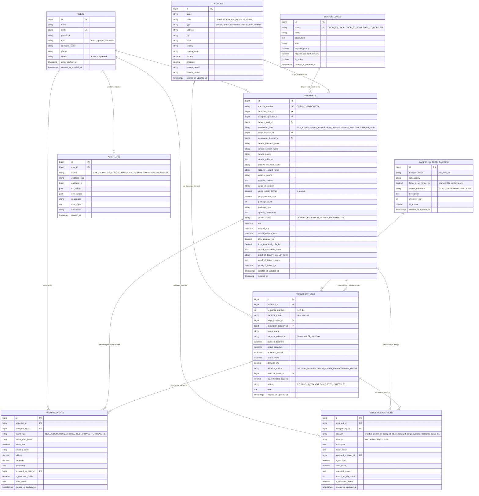

# EcoHorizon Global — Entity-Relationship Diagram (ERD)

```mermaid
erDiagram
    USERS ||--o{ SHIPMENTS : "customer/operator assignment"
    USERS ||--o{ TRACKING_EVENTS : "recorded by"
    USERS ||--o{ DELIVERY_EXCEPTIONS : "assigned operator"
    USERS ||--o{ AUDIT_LOGS : "performed action"
    SERVICE_LEVELS ||--o{ SHIPMENTS : "defines contractual terms"
    LOCATIONS ||--o{ SHIPMENTS : "origin & destination"
    LOCATIONS ||--o{ TRANSPORT_LEGS : "leg departure & arrival"
    CARBON_EMISSION_FACTORS ||--o{ TRANSPORT_LEGS : "applies g CO2e/t-km factor"
    SHIPMENTS ||--|{ TRANSPORT_LEGS : "composed of 1..N modal legs"
    SHIPMENTS ||--o{ TRACKING_EVENTS : "chronological event stream"
    SHIPMENTS ||--o{ DELIVERY_EXCEPTIONS : "disruptions & delays"
    TRANSPORT_LEGS ||--o{ TRACKING_EVENTS : "specific leg waypoints"
    TRANSPORT_LEGS ||--o{ DELIVERY_EXCEPTIONS : "leg disruption origin"

    USERS {
        bigint id PK
        string name
        string email UK
        string password
        string role "admin, operator, customer"
        string company_name
        string phone
        string status "active, suspended"
        timestamp email_verified_at
        timestamps created_at_updated_at
    }

    SERVICE_LEVELS {
        bigint id PK
        string code UK "DOOR_TO_DOOR, DOOR_TO_PORT, PORT_TO_PORT, B2B"
        string name
        text description
        string icon
        boolean requires_pickup
        boolean requires_recipient_delivery
        boolean is_active
        timestamps created_at_updated_at
    }

    LOCATIONS {
        bigint id PK
        string name
        string code "UN/LOCODE or IATA (e.g. IDTPP, SGSIN)"
        string type "seaport, airport, warehouse, terminal, door_address"
        string address
        string city
        string state
        string country
        string country_code
        decimal latitude
        decimal longitude
        string contact_person
        string contact_phone
        timestamps created_at_updated_at
    }

    CARBON_EMISSION_FACTORS {
        bigint id PK
        string transport_mode "sea, land, air"
        string subcategory
        decimal factor_g_per_tonne_km "grams CO2e per tonne-km"
        string source_reference "GLEC v3.0, IMO MEPC.308, DEFRA"
        text description
        int effective_year
        boolean is_default
        timestamps created_at_updated_at
    }

    SHIPMENTS {
        bigint id PK
        string tracking_number UK "EHG-YYYYMMDD-XXXX"
        bigint customer_user_id FK
        bigint assigned_operator_id FK
        bigint service_level_id FK
        string destination_type "door_address, seaport_terminal, airport_terminal, business_warehouse, fulfillment_center"
        bigint origin_location_id FK
        bigint destination_location_id FK
        string sender_business_name
        string sender_contact_name
        string sender_phone
        text sender_address
        string receiver_business_name
        string receiver_contact_name
        string receiver_phone
        text receiver_address
        string cargo_description
        decimal cargo_weight_tonnes "in tonnes"
        decimal cargo_volume_cbm
        int package_count
        string package_type
        text special_instructions
        string current_status "CREATED, BOOKED, IN_TRANSIT, DELIVERED, etc."
        datetime eta
        datetime original_eta
        datetime actual_delivery_date
        decimal total_distance_km
        decimal total_estimated_co2e_kg
        text carbon_calculation_notes
        string proof_of_delivery_receiver_name
        text proof_of_delivery_notes
        datetime proof_of_delivery_at
        timestamps created_at_updated_at
        timestamp deleted_at
    }

    TRANSPORT_LEGS {
        bigint id PK
        bigint shipment_id FK
        int sequence_number "1, 2, 3..."
        string transport_mode "sea, land, air"
        bigint origin_location_id FK
        bigint destination_location_id FK
        string carrier_name
        string transport_reference "Vessel voy, Flight #, Plate"
        datetime planned_departure
        datetime actual_departure
        datetime estimated_arrival
        datetime actual_arrival
        decimal distance_km
        string distance_source "calculated_haversine, manual_operator_override, standard_corridor"
        bigint emission_factor_id FK
        decimal leg_estimated_co2e_kg
        string status "PENDING, IN_TRANSIT, COMPLETED, CANCELLED"
        text notes
        timestamps created_at_updated_at
    }

    TRACKING_EVENTS {
        bigint id PK
        bigint shipment_id FK
        bigint transport_leg_id FK
        string event_type "PICKUP, DEPARTURE, ARRIVED_HUB, ARRIVED_TERMINAL, etc."
        string status_after_event
        datetime event_time
        string location_name
        decimal latitude
        decimal longitude
        text description
        bigint recorded_by_user_id FK
        boolean is_customer_visible
        text proof_notes
        timestamps created_at_updated_at
    }

    DELIVERY_EXCEPTIONS {
        bigint id PK
        bigint shipment_id FK
        bigint transport_leg_id FK
        string category "weather_disruption, transport_delay, damaged_cargo, customs_clearance_issue, etc."
        string severity "low, medium, high, critical"
        text description
        text action_taken
        bigint assigned_operator_id FK
        boolean is_resolved
        datetime resolved_at
        text resolution_notes
        int impact_on_eta_hours
        boolean is_customer_visible
        timestamps created_at_updated_at
    }

    AUDIT_LOGS {
        bigint id PK
        bigint user_id FK
        string action "CREATE, UPDATE, STATUS_CHANGE, LEG_UPDATE, EXCEPTION_LOGGED, etc."
        string auditable_type
        bigint auditable_id
        json old_values
        json new_values
        string ip_address
        text user_agent
        string description
        timestamp created_at
    }
```

